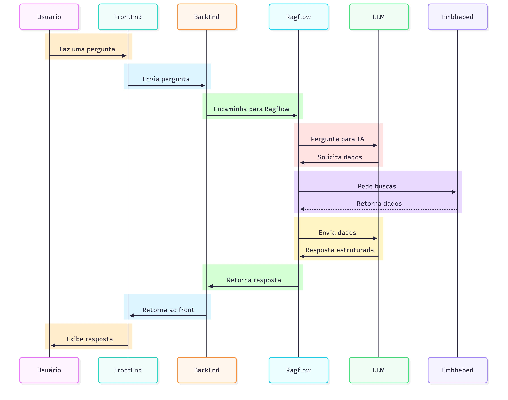

# 1. Visão Arquitetônica Inicial (Pré-Modelagem de Ameaças)

## 1.1. Introdução

Este documento descreve a visão arquitetônica inicial para o **Sistema de Acessos a Informação UFLA**. O objetivo do projeto é desenvolver uma solução centralizada, na forma de um chatbot, para responder a dúvidas frequentes dos discentes da Universidade Federal de Lavras (UFLA), que atualmente encontram informações dispersas em múltiplas plataformas institucionais como SIGA e Moodle.

Este documento foca na arquitetura funcional, servindo como a base para a posterior análise de riscos e modelagem de ameaças.

## 1.2. Solução Proposta e Componentes

A solução consiste em um sistema distribuído composto pelos seguintes elementos:

- **Frontend**: Uma interface de chat web onde o usuário interage, inserindo suas dúvidas.
- **Backend (API)**: Um microserviço que recebe as perguntas do frontend, processa-as e orquestra a comunicação com os agentes de IA.
- **Agente de IA (Ollama - Local)**: Um modelo de linguagem (LLM) rodando localmente em um contêiner Docker. Este agente será especializado em responder a perguntas com base em uma base de conhecimento pré-definida sobre os processos da UFLA.
- **Agente de IA (API Externa)**: Um segundo modelo de IA, acessado via API (ex: um modelo da OpenAI, Google, etc.), que pode ser usado para questões mais genéricas ou para enriquecer as respostas do agente local.

### Tabela 1: Tecnologias e Componentes

| Componente | Tecnologia/Framework | Responsabilidade |
| :--- | :--- | :--- |
| **Frontend** | HTML, CSS, JavaScript | Interface do usuário (UI) e interação com o chat. |
| **Backend** | Python (FastAPI/Flask) | Lógica de negócio, roteamento de requisições, API. |
| **Agente Local** | Ollama + Docker | Processamento de linguagem natural (PLN) com dados locais. |
| **Agente Externo** | API de terceiros | Capacidades estendidas de PLN. |
| **Comunicação** | Protocolo A2A (Agent-to-Agent) via APIs REST | Troca de informações entre os microserviços. |

## 1.3. Fluxo de Dados Inicial (DFD - Data Flow Diagram)

O fluxo de dados a seguir descreve como a informação se move através do sistema sem a implementação de controles de segurança avançados.

1.  **Usuário -> Frontend**: O usuário digita uma pergunta na interface do chat.
2.  **Frontend -> Backend**: A interface envia a pergunta do usuário para a API do Backend via uma requisição HTTP.
3.  **Backend -> Agentes de IA**: O Backend determina para qual agente de IA a pergunta deve ser enviada (ou para ambos) e encaminha a requisição.
4.  **Agentes de IA -> Backend**: Os agentes de IA processam a pergunta e retornam a resposta para o Backend.
5.  **Backend -> Frontend**: O Backend formata a resposta e a envia de volta para a interface do usuário.
6.  **Frontend -> Usuário**: A resposta é exibida para o usuário no chat.

Como a comunicação entre os agentes de IA através do RAG tem fluxo semelhante e estão suscetíveis as mesmas vulnerabilidades, resolvemos condensar a análise deles como apenas Agentes de IA para evitar ficar muito repetitivo.